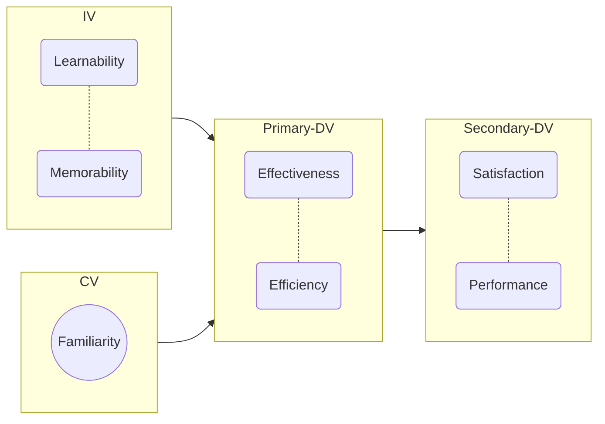

Deductive Reasoning 
for descriptive or causal research

- problem
- hypothesis
- variables
	dependent : value being measured, user satisfaction
	independent : manipulated value that influenced dependent variable, colour
	control : confounding variable, tech saviness

Inductive Reasoning
for exploratory research

- interviews

# Diagram

Prior to experimentation form a model to describe the expected relationships between the observed behaviours and triggers. This representation helps outline the experimental design.

Update the model as experiment data comes in.

# Reasoning

Deductive vs Inductive reasoning.

|Reasoning|Begin With|Use For|Method|Process|Answers|
|--|--|--|--|--|--|
|Deductive|Theory / Model|Testing|Quantitative|Objective|Who/What|
|Inductive|Phenomenae|Exploring|Qualitative|Subjective|How/Why|

# Data Sources

o = objective
s = subjective
## Primary

Quantitative
- behavioural (o)
- card sorting (s)
- neuro-physiological (o)
- psycho-physiological (o)
- surveys (s)
- tree testing (s)

Qualitative
- focus groups (s)
- interviews (s)
- observations (s)
- surveys (s)
- think aloud (s)
## Secondary

Internal
- CRM reports (o)
- web analytics (o)

External
- industry reports (o)
- literature reviews (o)
- web analytics (o)

**Web Analytics**

- identify users and tech
- track referral links into site or app
- track entry points, drop offs, duration

# Data

Nominal
- name
- gender
- colour
- brand
Order or Rank
- 1 to 5
Variables
- quantity
- duration

# Benchmarks

Benchmarks include research such as a competitive analysis.

compare
- features
- design
- best practices
- performance measures
- perceptual responses
